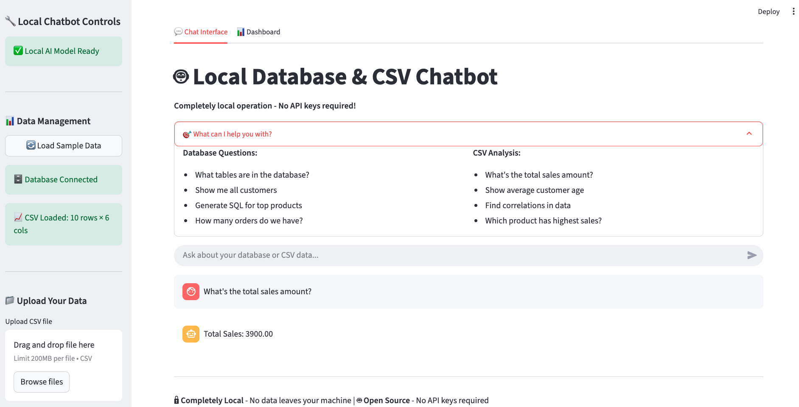

# 🤖 Intelligent Database & CSV Chatbot with RAG

## 🚀 Quick Start
**Completely local** chatbot with **Retrieval-Augmented Generation (RAG)** that can answer questions by querying databases and analyzing CSV data, with fine-tuning options for improved performance. **No API keys required!**


* Interactive local chatbot for database queries and CSV analysis - completely private and offline-capable*

## ✨ Features

- **🧠 RAG Enhancement**: Retrieval-Augmented Generation for context-aware responses
- **Completely Local**: No data leaves your machine - works offline
- **Open Source Models**: Uses HuggingFace transformers instead of paid APIs
- **Smart Question Routing**: Automatically chooses RAG vs traditional approach
- **Vector Search**: Advanced semantic search with ChromaDB (optional)
- **Graceful Fallbacks**: Works with or without advanced dependencies
- **Database Schema Reading**: Automatically reads database schemas and answers SQL-related questions
- **CSV Business Intelligence**: Processes CSV files to answer business questions
- **Fine-tuning Pipeline**: Improves chatbot performance using question-answer pairs
- **Mock Data Integration**: Uses open data sources for demonstration
- **Multi-modal Q&A**: Handles both technical (SQL) and business questions
- **Enhanced Web Interface**: Beautiful Streamlit-based web interface with dashboards
- **CLI Interface**: Command-line interface for quick testing
- **Jupyter Integration**: Interactive notebooks for data exploration

## Quick Start

### 1. Clone and Setup
```bash
git clone https://github.com/chaul3/chat-bot-sql-generator-for-business.git
cd chat-bot-sql-generator-for-business
```

### 2. Install Dependencies
```bash
# Basic dependencies
pip install -r requirements.txt

# For advanced RAG features (recommended)
pip install sentence-transformers chromadb faiss-cpu
```

### 3. Initialize Project
```bash
python initialize_project.py
```

### 4. Run the Chatbot
```bash
# Enhanced local web interface with RAG (RECOMMENDED)
.venv/bin/python -m streamlit run local_demo.py

# Original web interface
.venv/bin/python -m streamlit run main.py

# Or command line interface
.venv/bin/python scripts/cli_chatbot.py

# Or run the demo with RAG
.venv/bin/python demo.py

# Test the local chatbot engine
.venv/bin/python test_local_chatbot.py

# Interactive Jupyter notebook with RAG demo
jupyter notebook notebooks/demo.ipynb
```

##  Local Demo Features with RAG

The enhanced local demo (`local_demo.py`) offers:

###  **🧠 RAG Enhancement**
- **Context-Aware Responses**: Uses relevant data chunks to improve answers
- **Smart Question Routing**: Automatically detects when to use RAG vs traditional
- **Advanced Mode**: Uses sentence-transformers + ChromaDB for semantic search
- **Simple Mode**: Keyword-based fallback when advanced dependencies unavailable
- **Real-time Indexing**: Automatically indexes uploaded CSV data
- **🧪 RAG Testing Controls**: Switch between RAG/Traditional modes for comparison
- **⚡ Quick Test Buttons**: Pre-built questions to demonstrate RAG differences

###  **Completely Private**
- All processing happens on your machine
- No data sent to external APIs
- Works completely offline after initial setup

###  **Enhanced Interface**
- **Chat Interface**: Interactive chat with your data
- **Statistics Dashboard**: Real-time data insights
- **Sidebar Controls**: Easy data management
- **File Upload**: Drag & drop CSV files
- **Quick Actions**: One-click schema viewing and data summaries

###  **Smart AI Features**
- **Local AI Models**: Uses HuggingFace transformers
- **Pattern Matching**: Intelligent question classification
- **SQL Generation**: Automatic query generation from natural language
- **Data Visualization**: Interactive charts and graphs
- **Graceful Fallbacks**: Works even without AI models installed

### **Data Analysis**
- **Database Exploration**: Automatic schema reading and visualization
- **CSV Analytics**: Statistical analysis and business insights
- **Correlation Analysis**: Find patterns in your data
- **Interactive Charts**: Plotly-powered visualizations

##  Usage Examples

The chatbot can handle questions like:

### Database Questions
- "What tables are in the database?"
- "Show me the schema for the customers table"
- "Generate a SQL query to find top customers"
- "How many orders do we have?"

### CSV Analysis Questions
- "What's the total sales amount?"
- "Show me the average customer age"
- "Which product has the highest sales?"
- "What's the distribution by region?"

### RAG-Enhanced Analytical Questions
- "Analyze patterns in the sales data"
- "Explain the relationship between customer demographics and purchases"
- "What trends do you see in the revenue data?"
- "Compare performance across different product categories"
- "Tell me about correlations in this dataset"

### Business Intelligence with Context
- "Show me insights from customer behavior patterns"
- "Identify the most profitable customer segments"
- "What factors influence sales performance?"
- "Explain seasonal trends in our data"

## 📊 Sample Data

The project includes comprehensive sample data:

### Database Tables
- **Customers**: 5 sample customers with demographics
- **Products**: 5 products across different categories
- **Orders**: 7 sample transactions
- **SQL Questions**: Training data for fine-tuning

### CSV Files
- **Sales Data**: Product sales by region and date
- **Customer Data**: Customer demographics and spending
- **Employee Data**: HR data with performance metrics

###  **Want More Data?** 
For additional datasets perfect for your chatbot, see **[DATASETS.md](DATASETS.md)** for curated toy datasets including:
- 🏪 **Superstore** (10K+ sales records)
- 💼 **HR Analytics** (employee data)
- 🏠 **Real Estate** (housing market data)
- 🚗 **Automotive** (car sales data)
- 📈 **Financial** (stock market data)

All datasets include sample questions and usage guidelines!
- **Customer Data**: Customer demographics and spending
- **Employee Data**: HR data with performance metrics

##  Architecture

```
├── src/                    # Core source code
│   ├── chatbot/           # Main chatbot engine
│   ├── database/          # Database management
│   ├── csv_processor/     # CSV analysis
│   ├── fine_tuning/       # Model fine-tuning
│   └── utils/             # Utility functions
├── data/                  # Sample data and generators
├── config/                # Configuration files
├── scripts/               # CLI tools and utilities
├── tests/                 # Unit tests
├── notebooks/             # Jupyter notebooks
└── models/                # Trained models (created at runtime)
```

##  Configuration

### Environment Variables
Copy `.env.example` to `.env` and configure:

```bash
# OpenAI API Key (for GPT models)
OPENAI_API_KEY=your_openai_api_key_here

# Application settings
DEBUG=True
LOG_LEVEL=INFO
```

### Model Configuration
- **Primary Model**: Local HuggingFace models (DialoGPT, GPT-2, etc.)
- **Fallback**: Rule-based pattern matching (works without any models)
- **Optional**: OpenAI models (requires API key)
- **Completely Local**: No internet connection required after setup

## 🧪 Testing RAG vs Traditional

The web interface includes powerful testing controls:

### RAG Mode Controls:
- **🤖 Auto Mode**: Smart detection of when to use RAG vs traditional
- **🧠 Force RAG**: All questions use RAG enhancement for testing
- **📊 Force Traditional**: Disable RAG to compare traditional responses

### Quick Testing:
- **⚡ Test Buttons**: Pre-built questions to demonstrate differences
- **🔄 Reset Chat**: Clear conversation history for fresh testing
- **📊 Live Indicators**: Each response shows which approach was used

### Example Test Workflow:
1. Load sample data
2. Ask "What's the total sales?" in Traditional mode
3. Switch to RAG mode and ask "Analyze sales patterns"
4. Compare the depth and context of responses
5. Use Auto mode to see intelligent routing

For detailed testing guide, see **[RAG_TESTING_GUIDE.md](RAG_TESTING_GUIDE.md)**

##  Testing

```bash
# Test the local chatbot engine
.venv/bin/python test_local_chatbot.py

# Run the enhanced local demo
.venv/bin/python -m streamlit run local_demo.py

# Run the original demo
.venv/bin/python demo.py

# Run unit tests
.venv/bin/python tests/test_chatbot.py

# Test setup
.venv/bin/python test_setup.py
```

##  Fine-tuning

To improve the chatbot's performance:

```bash
# Generate training data and fine-tune model
python scripts/fine_tune_model.py
```

This will:
1. Collect training data from SQL questions and CSV examples
2. Fine-tune a base model (DialoGPT)
3. Save the fine-tuned model for future use

##  Jupyter Notebook

Explore the interactive demo:

```bash
jupyter notebook notebooks/demo.ipynb
```

The notebook covers:
- Database operations
- CSV analysis
- Question classification
- Training data generation
- Business insights

## Extension Points

### Adding New Data Sources
1. Create a processor in `src/`
2. Add classification patterns
3. Update chatbot routing

### Custom Models
1. Extend `ModelManager`
2. Add model-specific configuration
3. Update interface options

### Business Logic
1. Add custom analyzers
2. Extend question patterns
3. Create domain-specific insights

## Troubleshooting

### Common Issues

**Missing Dependencies**
```bash
pip install -r requirements.txt
```

**Database Errors**
```bash
python initialize_project.py
```

**Import Errors**
- Ensure you're in the project directory
- Check Python path configuration

### Debug Mode
Enable detailed logging in `.env`:
```
DEBUG=True
LOG_LEVEL=DEBUG
```

## Performance Features

- **Intelligent Routing**: Questions are classified and routed to appropriate handlers
- **Caching**: Results are cached for repeated questions
- **Streaming**: Large CSV files are processed efficiently
- **Error Handling**: Graceful fallbacks for various error conditions

## Security

- **SQL Injection Prevention**: Parameterized queries only
- **File Upload Validation**: Type and size restrictions
- **API Key Management**: Environment variable storage
- **Sandboxed Execution**: Safe query execution environment

## Requirements

- Python 3.10+
- Required packages (see `requirements.txt`)
- Optional: OpenAI API key for enhanced responses
- Optional: GPU for faster model fine-tuning

## License

This project is open source and available under the MIT License.
---

**Happy Chatting! 🤖✨**
